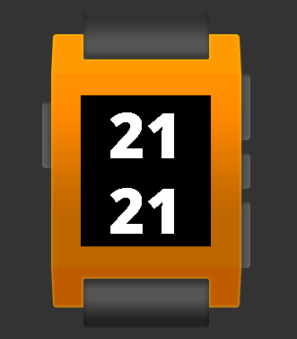

# pebble-my-watchface

> My own Pebble watchface.



### Goals

* display hours and minutes in large font
* start vibration on each full hour, ex. `4:00`, `12:00`
* enable backlight which is disabled after couple seconds

## Build

Test on emulator:

```
pebble build && pebble install --emulator basalt
```

Deploy to device:

```
pebble build && pebble install --cloudpebble
```

## Help links

* https://github.com/JvetS/PebbleSimulator/blob/master/PebbleSimulator/pebble_fonts.h
* https://developer.pebble.com/guides/tools-and-resources/color-picker/
* https://developer.pebble.com/docs/c/Foundation/Event_Service/TickTimerService/#TimeUnits
* https://developer.pebble.com/docs/c/User_Interface/Light/
